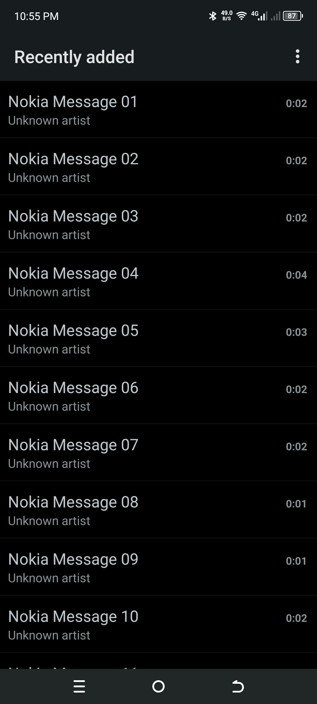
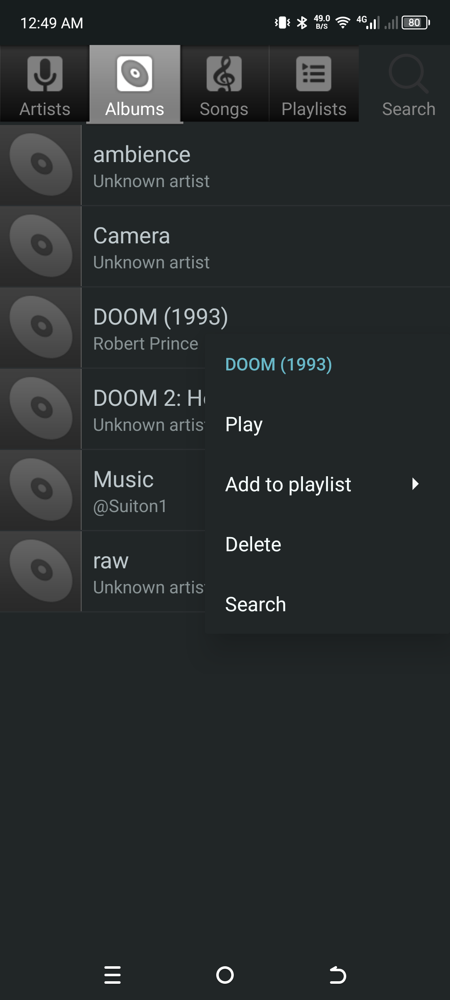
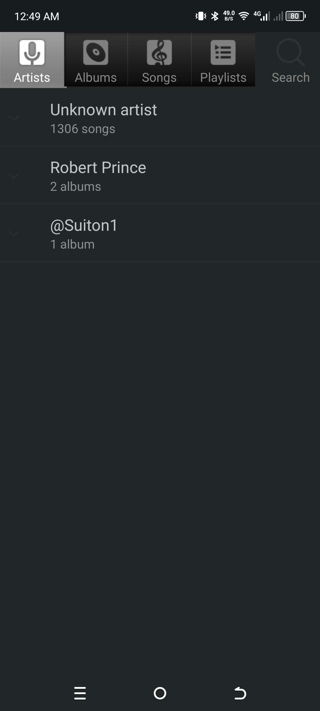
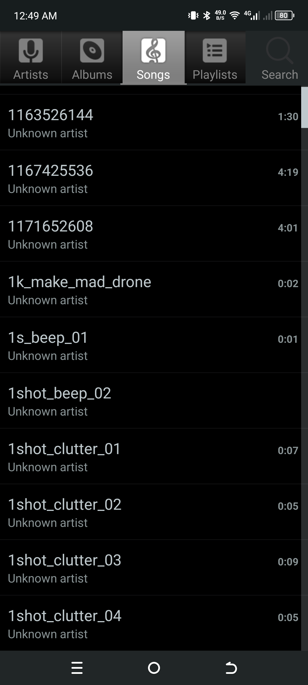
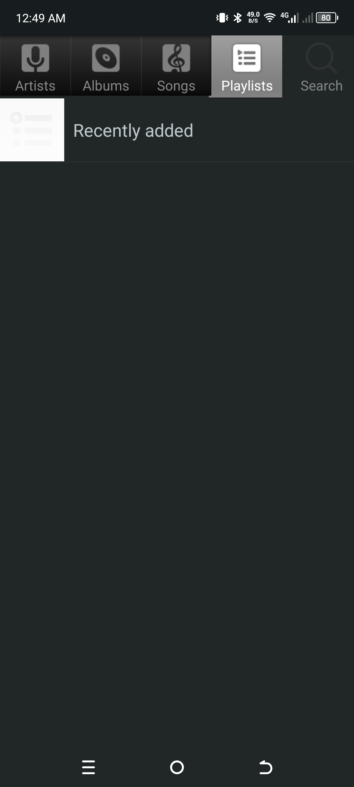
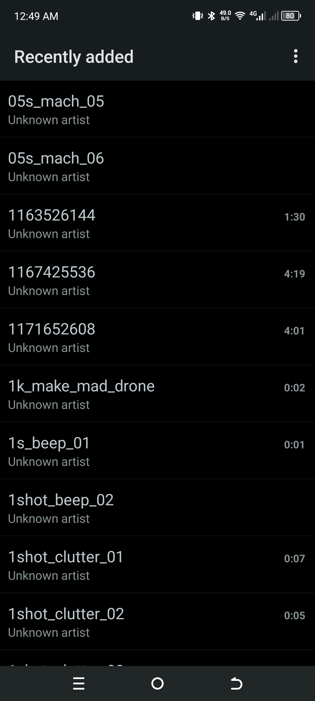
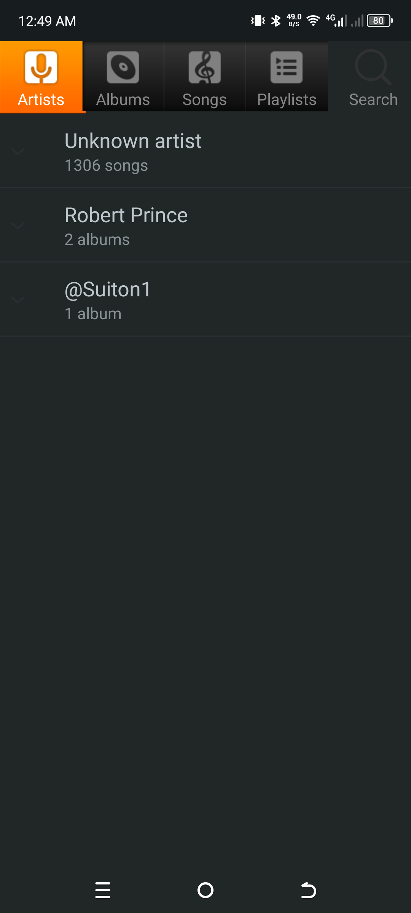
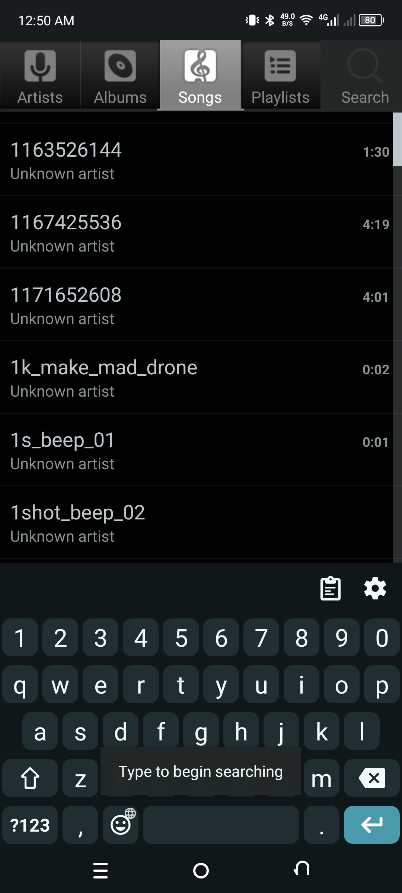
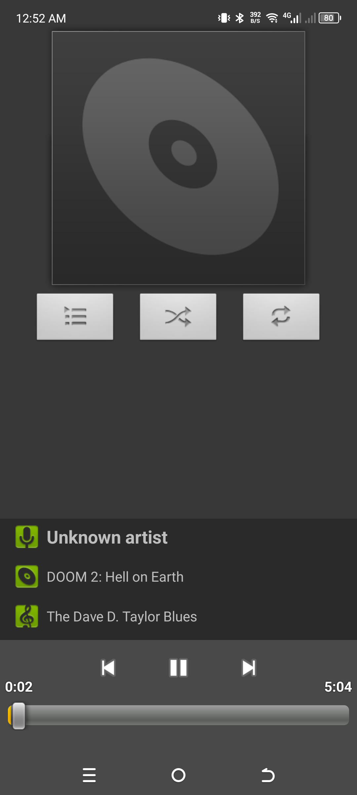
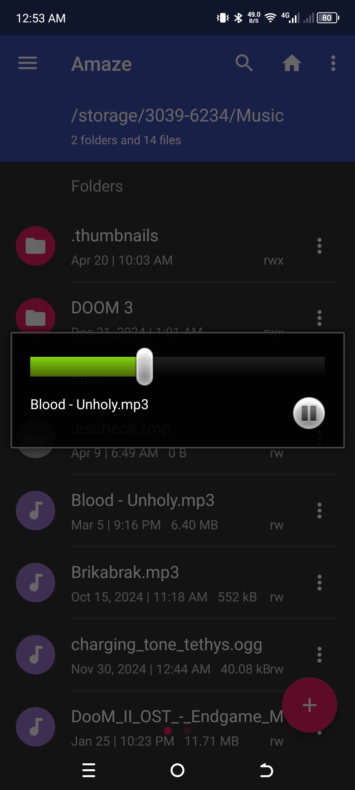

# AOSP Music+
(from upstream repo)   
Dump of the last version of the source code of AOSP Music+ 

As I never used source control for this project, all we have is an initial commit.

This project is based off the [AOSP stock music app](https://github.com/aosp-mirror/platform_packages_apps_music), ported to work in Android Studio and with added features such as:

 - Lockscreen / notification music controls (**not working on v1.3.3**)
 - Slightly refreshed "Now playing" screen.
 
~~This app is no longer maintained, however is uploaded here for backup~~
# Some screenshots

